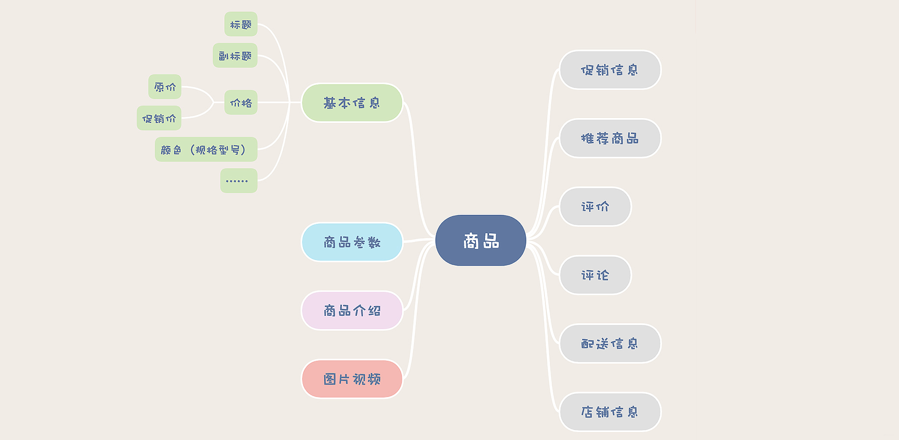

### 商品存储方案
[文章参考](https://cloud.tencent.com/developer/article/1633979)

 

1. 存储分割

- 商品基本信息
- 商品参数
- 图片视频
- 商品介绍

2. 存储定义：
   - 商品基本信息：
     - 采用mysql对基本结构进行存储，在查询的时候使用redis抵挡大部分请求
       ，使用Cache Aside缓存读写策略避免mysql数据更新缓存的是旧的数据
     - 保留商品数据的每一个历史版本,因为商品数据是随时变化的，但是订单中关联的商品数据，必须是下单那个时刻的商品数据，这一点很重要。你可以为每一个历史版本的商品数据保存一个快照，可以创建一个历史表保存到MySQL中，也可以保存到一些KV存储中。

   - 商品参数：
     - mongodb保存商品参数

   - 图片视频：
     - 使用对象存储保存图片和视频
   - 商品介绍：
     - 商品介绍静态化,商品介绍在商详页中占得比重最大，包含大量的带格式文字、图片和视频.
       其中图片和视频自然要存放在对象存储里面，商品介绍的文本，一般都是随着商详页一起静态化，保存在HTML文件中。


### mysql数据表设计
1. 商品基本信息表
```sql
CREATE TABLE `goods` (
     `img` varchar(255) CHARACTER SET utf8mb4 COLLATE utf8mb4_0900_ai_ci DEFAULT NULL COMMENT '图片',
     `preface` text COMMENT '简介',
     `price` varchar(255) DEFAULT NULL COMMENT '价格',
     `good_id` varchar(255) DEFAULT NULL COMMENT '商品ID',
     `id` int unsigned NOT NULL,
     PRIMARY KEY (`id`)
) ENGINE=InnoDB DEFAULT CHARSET=utf8mb4 COLLATE=utf8mb4_0900_ai_ci;
```